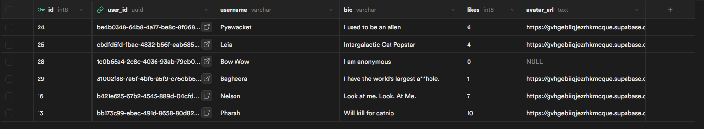
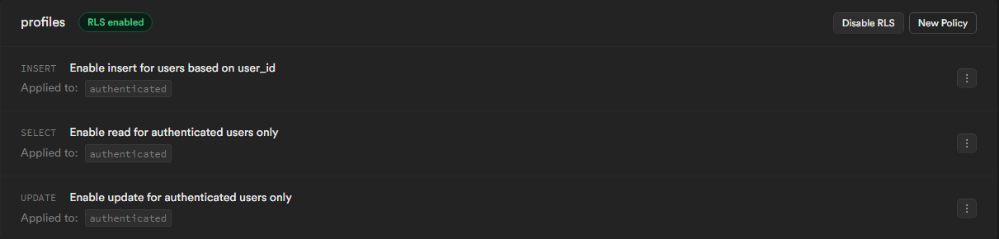
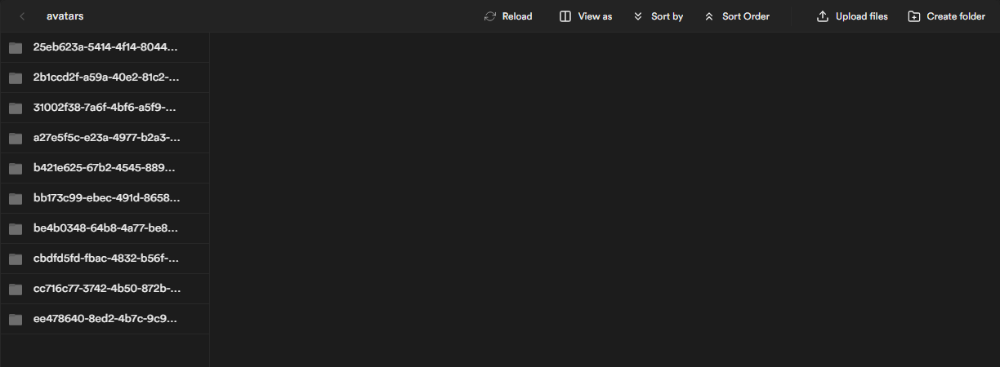

# Plan

## Table

    - Profiles
        - id
        - user_id (foreign key to users table)
        - username (could use email)
        - bio
        - stars
        - avatar_url

## Pages

    - profile editor/creator
    - profile list (home)
    - profile detail

## HTML

    - editor page
        - FORM
            - input with label for USERNAME
            - input with label for BIO
            - input with label for Avatar
            - img (for preview of the avatar)
            - button
            - p tag in error display
        - profile list
            - list container that is hardcoded
        - profile detail
            - hardcode an img & header
            - stars detail container

### Events

    - editor page
        - page load -> getting profile information from supabase and display on form (if exists)
        - avatar image input ("change") -> display img preview
        - form submit
            - utilize the users input and send it to supabase
            - upsert to send supabase
            - error handling to display issues to user
        - profiles page
            - up and down vote button clicks
                - increment or decrement the stars count in supabase
            - page load fetch
        - profiles list
            - page load fetch

### Functions

    - uploadImage(imagePath, imageFile)
    - upsertProfile(profile)
    - getProfile(user_id) & getProfileById(id)
    - incrementStars(id) and decrementStars(id)

### Slices

    - create/edit simple profile (username & bio)
    - add in avatar upload to profile
    - get Profile back from supabase (use it to fill in the form)
    - error handling & button disable
    - profiles list
    - profile detail page & stars up and down votes

-   working on the /profile page

## Part B

### HTML

    - form for message input (with label and button)

### Events

    - page load -> add subscribing for realtime updates on CREATE of message
    - form submit
        - get user's form input values
        - check sender user has profile info
        - send message to supabase
        - reset the form
        - (before we implement realtime) call our fetchAndDisplay function

### Functions

    - createMessage
    - onMessage (for realtime)

### Slices

    - messages table in supabase
        - will have id, created_at, text, sender, recipient_id(link to profile.id), user_id
    - create Messsage functionality
    - implement realtime updates
